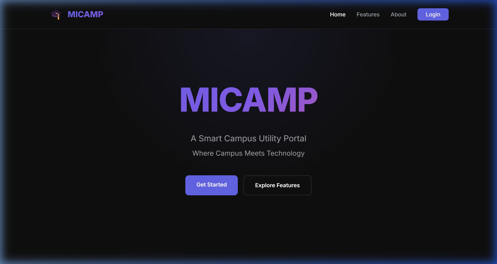
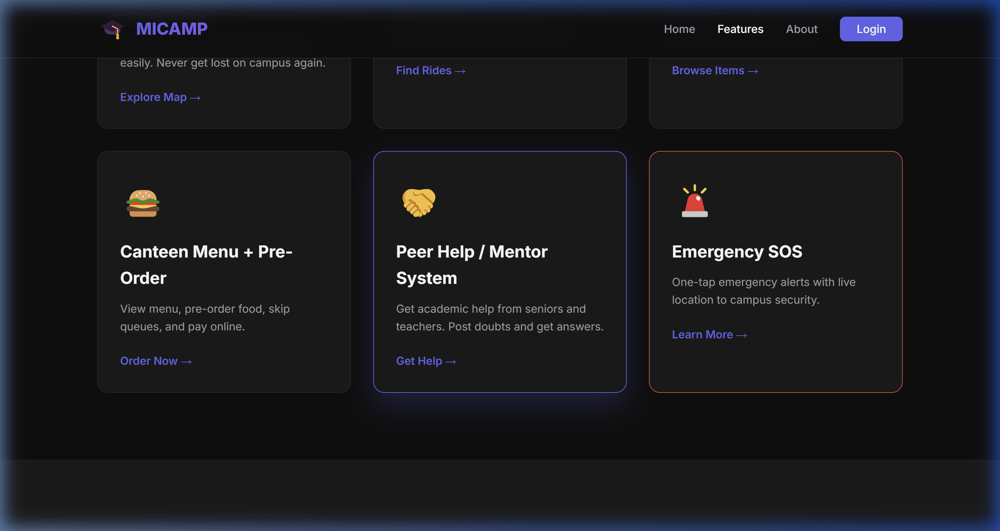

<div align="center">
  <h1>🎓 MiCamp</h1>
  <p><strong>A Smart Campus Utility Portal designed for RNSIT</strong><br/><em>Where Campus Meets Technology</em></p>

  <p>
    <a href="https://mi-camp.vercel.app/" target="_blank">
      
    </a>
    <a href="https://github.com/Rajadi16/MiCamp/blob/main/LICENSE">
      
    </a>
    
    
  </p>

  <p>
    <a href="#-about-the-project">About</a> •
    <a href="#-key-features">Features</a> •
    <a href="#-tech-stack">Tech Stack</a> •
    <a href="#-getting-started">Installation</a> •
    <a href="#-deployment">Deployment</a>
  </p>
</div>

<br/>

## 🌟 About The Project

MiCamp is an integrated smart campus portal designed specifically for **RNS Institute of Technology (RNSIT)** that brings together multiple essential campus services into a single, cohesive smart platform. 

Our goal is to save time, improve campus safety, encourage student collaboration, and promote an eco-friendly smart campus initiative while reducing manual paperwork.

### 📸 Preview

#### Homepage


#### Features Layout


---

## ✨ Key Features

1. **🗺️ Campus Map + Navigation:** 
   Find classrooms, labs, and facilities easily. Live tracking included so you never get lost on campus again.
   
2. **🚗 Ride / Vehicle Pool:** 
   Share rides with classmates for eco-friendly commuting and cost-saving solutions.
   
3. **🎒 Lost & Found System:** 
   Report or search for lost items efficiently with photo matching capabilities.
   
4. **🍔 Canteen Menu + Pre-Order:** 
   View interactive menus, pre-order food, skip long physical queues, and process online payments smoothly.
   
5. **🤝 Peer Help / Mentor System:** 
   A collaborative zone to get academic help from peers, seniors, and teachers. Post doubts and receive answers.
   
6. **🚨 Emergency SOS:** 
   One-tap emergency alerts pushing live location directly to campus security personnel for immediate assistance.

---

## 🛠 Tech Stack

### Frontend
- **Languages:** HTML5, CSS3, JavaScript (Vanilla ES6+)
- **Architecture:** Modern responsive design (Mobile First)
- **Tooling:** No explicit build tools required; extremely lightweight.

### Backend
- **Environment:** Node.js + Express framework
- **Languages:** TypeScript
- **Features:** RESTful APIs + Server-Sent Events (SSE) for live mapping updates
- **Database:** Fast in-memory volatile storage (easily switchable to MongoDB/PostgreSQL later)

---

## 🚀 Getting Started

To get your development environment running locally, follow these steps.

### Prerequisites

- **Node.js** (v16 or higher) - [Download](https://nodejs.org/)
- **Python** (v3.7 or higher) - [Download](https://python.org/) (Used for quick frontend serving)
- **Git** - [Download](https://git-scm.com/)

### Installation 

1. **Clone the repository:**
   ```bash
   git clone https://github.com/Rajadi16/MiCamp.git
   cd MiCamp
   ```

2. **Easiest Start (One Command for Windows):**
   ```bash
   start-all.bat
   ```
   *This single script automatically initiates both your frontend and backend environments side-by-side.*

#### Manual Setup Alternative

**Backend Setup:**
```bash
cd backend
npm install

# Copy config templates
cp env.example .env

# Run Development Server
npm run dev
```

**Frontend Setup (in a new terminal):**
```bash
# Recommended Python server
cd MiCamp
python -m http.server 8080
```
Then simply open your browser to **http://localhost:8080**.

---

## 📡 API Architecture Highlights

MiCamp's API handles various complex tasks over simple endpoints.

- `GET /health` – Returns service health status.
- `GET /api/map/locations` – Fetch spatial campus data.
- `POST /api/rides` – Create secure peer rides.
- `GET /api/live-location/stream` – **SSE Stream** for live campus movement logic.

*Note: The frontend config automatically attaches to `localhost:4000` via `/js/config.js` while working securely in production contexts over HTTPS.*

---

## 🌐 Deployment

MiCamp is structured for incredibly smooth cloud deployments. 

- **Backend:** Highly recommended to host on **[Render](https://render.com/)**, leveraging their free web services. Detailed documentation is provided in our [Render Quick Start Guide](RENDER_QUICK_START.md).
- **Frontend:** Perfect for modern edge networks like **[Vercel](https://vercel.com/)**.
- **Self-Hosting:** Usable over standard `cPanel` or `Apache2` environments provided you establish adequate Node.js proxies.

To see step-by-step CI/CD procedures, refer to our [Deployment Documentation](DEPLOYMENT.md).

---

## 🔮 Future Enhancements

- **AI Chat Assistant:** Handle generic student queries rapidly.
- **Direct UPI integration:** Secure seamless canteen checkout.
- **PWA Conversion:** Fully installable mobile application with Background Push Notifications.
- **Biometric API hooks:** Integrating facial recognition directly into emergency protocols.

---

## 👥 The Team

Brought to life by the brilliant students of **RNSIT**:
- **Shashikanth Gidaganti** (1RN23CS258)
- **Pranathi D** (1RN23CS145)
- **Neethu B Krishna** (1RN23CS131)
- **Rajput Aditya Singh** (1RN23CS163)

## 📝 License

Distributed under the **MIT License**. See `LICENSE` for more information.

<br/>
<div align="center">
  <i>Built with ❤️ for the RNSIT Community</i>
</div>
